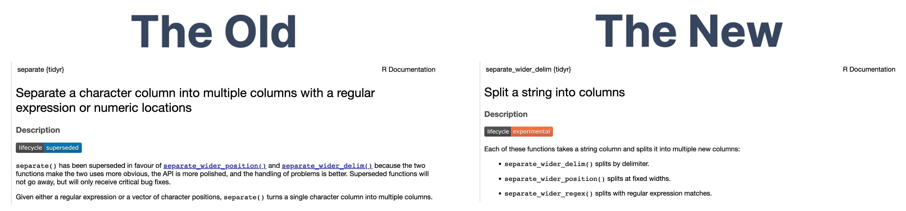

```{r, include=FALSE, eval = TRUE}
options(htmltools.preserve.raw = FALSE)
library(tidyverse)
library(readxl)
library(janitor)
library(fivethirtyeight)
library(here)
library(gapminder)
library(patchwork)
library(tweetrmd)
```


<!---- PLAN

Other types of tidy data - surveys! separate()

- Compare SurveyMonkey & Qualtric which make multiple columns, vs Google Form uses one column
--- Make a thread comparing 


--->

# Agenda

--

1. Housekeeping

--

1. Other functions for tidying data

--

1. Tidying survey data

--

1. Next week

---

# Housekeeping

--

GitHub Desktop

--

Can submit assignments as gists

--

Office hours

--

[1-on-1's with Charlie](https://savvycal.com/charliejhadley-r-for-the-rest-of-us/chat)

---

class: inverse, center, middle

# Other functions for tidying data

---

class: inverse, center, middle
background-image: url("images/broken-screen.jpg")

# We need to talk about how packages evolve

---

# Package lifecycles

Infrequently, the folks managing the tidyverse choose to **supercede** old functions with new **experimental** functions.

We're going to look at two functions that are undergoing this process - `separate()` and `separate_rows()`.

The documentation is the primary way you'll learn of lifecycle changes.



---

# Don't Panic

This is a rare process and does not mean old code will stop working. 

Old functions will remain, but the new functions are always designed with the user in mind.

We recommend learning the new functions now as the documentation and future material you'll find will use it.

---

# Ok, but why this change?

For consistency!!!

A few years ago `gather()` and `spread()` were renamed to `pivot_longer()` and `pivot_wider()` to make their connection tidy data more explicit.

The `separate()` and `separate_rows()` functions are very similar in that one makes data wider and the other makes it longer:

- `separate()` is becoming `separate_wider_*()`

- `separate_rows()` is becoming `separate_longer_*()`

---

## separate_wider_delim()

The `separate_wider_delim()` function is useful when a column contains **multiple variables** split by a common set of characters.

```{r, eval=TRUE}
location_data <- tribble(
  ~id, ~address,
  1, "Las Vegas, USA",
  2, "Bristol, UK",
  3, "Kassala, Sudan"
)
location_data
```


---

## separate_wider_delim()

```{r, eval=TRUE}
location_data %>% 
  separate_wider_delim(address,
                       delim = ", ",
                       names = c("city", "country"))
```

---

## separate_longer_delim()

The `separate_longer_delim()` function is useful when a column contains **multiple observations of the same variable**.

---

## separate_longer_delim()

Which of these devices do you own? Please select all that apply.

--

```{r, eval=TRUE, echo=TRUE}
device_ownership <- tribble(
  ~name, ~devices_owned,
  "Charlie", "Smart TV, Cell phone",
  "Mohammad", "Cell phone",
  "Christina", "Smart TV, Games Console, Cell phone"
)
device_ownership
```

---

## separate_longer_delim()

```{r, eval=TRUE, echo=TRUE}
device_ownership %>% 
  separate_longer_delim(devices_owned,
                        delim = ", ")
```

---

## Tidy data definition

--

1. Every column is a variable.

--

1. Every row is an observation.

--

1. Every cell is a single value.


---

class: inverse, center, middle

# Multiple choice survey questions

---

class: middle

```{r echo = FALSE}
tweet_embed("https://twitter.com/charliejhadley/status/1519696924328214528",
            align = "center")
```

---

# Let's tidy the survey data!

Let's read in and tidy the survey data from:

- Survey Monkey

- Qualtrics

- Google Forms

---

class: inverse, center, middle

# User-defined functions

---

# User-defined functions

During this week's videos you learned about creating user-defined functions.

This is a really powerful part of learning a programming language like R. They allow you to re-use code to do multiple things, including:

- Clean data files that share the same format (eg yearly reports)

- Create data visualizations of different subsets of your data, eg a line chart showing visitor numbers for each exhibit

- Generate the same report - including lots of different kinds of charts and tables - different subsets of data. This is something we do in consulting projects, eg for [ORS Impact Reports](https://funderscommittee.org/2020censusstatereports/).

---

class: inverse, center, middle

# Next Week

---

# Next week

- Catch-up week

--

- [Remember you have a 1-on-1 with Charlie](https://savvycal.com/charliejhadley-r-for-the-rest-of-us/chat)