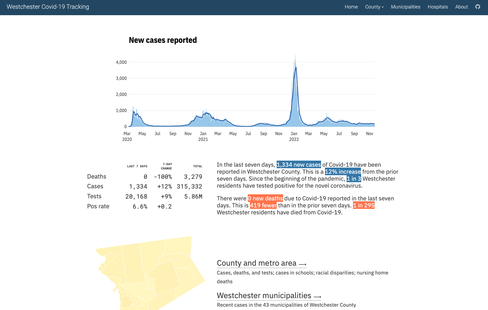

```{r, include=FALSE, eval = TRUE}
options(htmltools.preserve.raw = FALSE)
library(tidyverse)
library(fivethirtyeight)
library(readxl)
library(janitor)
library(patchwork)
library(here)
library(gapminder)
library(ggtext)
```


# Agenda

1. What else can RMarkdown do?

--

1. Quarto

--

1. Final assignment: show us what you can do!

--

1. Final week

---

class: inverse, center, middle

# What else can RMarkdown do?

---

## RMarkdown can do a lot...

We've seen that you can make the following:

--

.pull-left[

- HTML reports

- PDF reports

- Word reports

... but there's a lot more.
]

--

.pull-right[

- Beautiful books with `bookdown`

- Beautiful reports with `pagedown`

- Beautiful slides with `xaringan`

- Programmatically generated reports

- Dashboards (... and even shiny apps!)

- Websites all in RMarkdown!


]

---

class: inverse, center, middle

# Books

---

## Beautiful books with `bookdown`

.pull-left[
The `bookdown` package was used for writing R for Data Science and many other extremely useful R books.
]

.pull-right[


]

???

https://rfortherestofus.com/2022/04/bookdown/
https://book.rwithoutstatistics.com/

---

class: inverse, center, middle

# PDF Reports


---

## Beautiful reports with `pagedown`

.pull-left[
The `pagedown` package is designed to simplify designing documents you need to print.

Instead of learning `LaTeX` you can use HTML and CSS!

[Blog post on customizing `pagedown`](https://rfortherestofus.com/2022/11/no-designer-needed/)

]

.pull-right[
<center></center>
]

---

## `pagedreport`

.pull-left[
R for the Rest of Us has created a package called [`pagedreport`](https://pagedreport.rfortherestofus.com/) that adds several templates to `pagedown`.

]

.pull-right[
<center></center>
]


---

class: inverse, center, middle

# Websites

---

[](https://westchester-covid.mattherman.info/)


---


## `distill` for websites (and blogs)

Using `distill` is the easiest way to create a fully functioning website with RMarkdown.


---

class: inverse, center, middle

# Parameterized reports

---

## Parameterized reports

Use [parametrized RMarkdown reporting](https://bookdown.org/yihui/rmarkdown/parameterized-reports.html) to make a separate report for each group

???

https://book.rwithoutstatistics.com/parameterized-reports-chapter.html

---

class: inverse, center, middle

# Quarto...

---

### Quarto is the next generation of RMarkdown

.pull-left[

Quarto is a new technology that will be the future of RMarkdown.

> And RMarkdown is **not** going away. RMarkdown will continue to be supported and developed into the future.

]

.pull-right[


]

---

### Why does Quarto exist?

.pull-left[

RMarkdown is quite limited in that it's only useful for folks in the R community.

Quarto is designed from the ground up to work for R, Python and Julia users.
]

.pull-right[


]

---

### Where to find out more about Quarto

.pull-left[

[Tom Mock](https://twitter.com/thomas_mock) from Posit gave a [great 2h workshop on Quarto](https://www.youtube.com/watch?v=yvi5uXQMvu4) we'd recommend.

Actually using Quarto is not much different from RMarkdown

````{verbatim}
---
title: "Untitled"
format: html
---

Everything's the same except:

- We use `format` instead of `output` in the YAML header

- Code chunk options are written differently

```{r}
#| echo: false
rep("lots of cats", 5)
```
````


]

.pull-right[


]


???

https://book.rwithoutstatistics.com/quarto-chapter.html

---

# Final Week

--

In the final live session we'll cover:

--

- Show a project from start to finish

--

- What resources to use next

--

- How to ask reproducible questions with {reprex}

---

class: inverse, center, middle

# Final assignment

---

### Final assignment


We'd like you to record a 5 minute video showing something you can now do with your real data/project.

--

There's a form to fill on [Week 13's assignment submission page](https://rfortherestofus.com/courses/r-in-3-months-spring-2023/lessons/r-in-3-months-spring-2023-final-project-assignment/).


---

# Feedback

We love doing this type of training and want to continually improve it.

--

Please fill out this [post-survey that shows your skill now](https://forms.gle/i6r2EHtEcQw1GQ7C8) (we'll compare this to what you told us in the pre-survey) and allows you to provide anonymous feedback.

---

# Next Week

--

- No course assignments

--

- Record a <5-minute video showing what you've learned

--

- Please complete [post-survey](https://forms.gle/i6r2EHtEcQw1GQ7C8)


